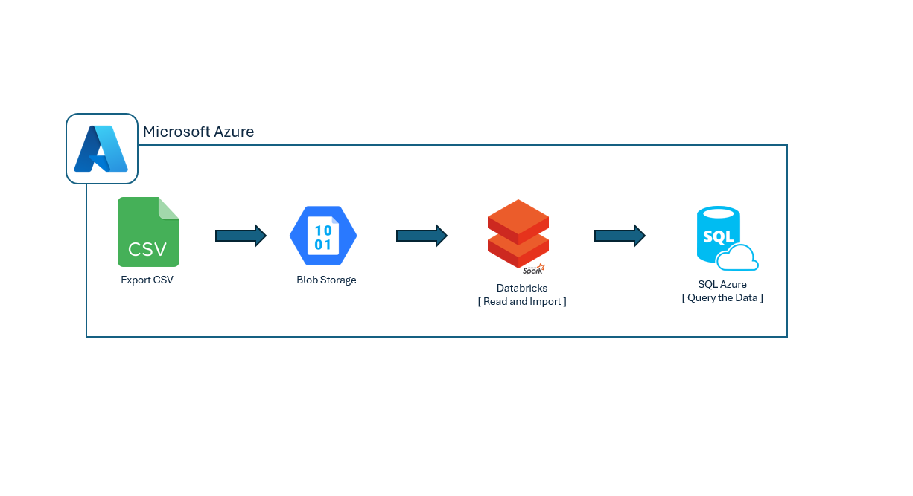

# Azure Pipeline: Bulking with Databricks

## Overview
The script performs the following tasks:
1. Establishes a JDBC connection to an Azure SQL Database.
2. Mounts an Azure Blob Storage container to Databricks file system (DBFS).
3. Reads a CSV file from the mounted storage.
4. Inserts the data from the CSV file into an Azure SQL table.

## Prerequisites

1. **Azure SQL Database**:
   - Database URL: `check your connection URL string under your database`
   - Username and password for the database.

2. **Azure Blob Storage**:
   - Storage account name.
   - Storage account key.
   - Blob container name.

3. **Databricks**:
   - A Databricks environment set up with the Spark engine.
   - Appropriate permissions to mount storage and write data to the database.

4. **Dependencies**:
   - Databricks utilities (`dbutils`).
   - JDBC driver for SQL Server (`com.microsoft.sqlserver.jdbc.SQLServerDriver`).

## Script Details

### 1. JDBC Connection
The script defines JDBC connection properties for the Azure SQL Database. These properties include the database URL, username, password, and security settings.

### 2. Mount Azure Blob Storage
The script checks if the specified Azure Blob Storage container is already mounted. If not, it mounts the storage to a specified mount point in the Databricks file system (DBFS).

- **Mount Point**: `/mnt/american-container`
- **Source**: Azure Blob Storage container.

### 3. Read CSV File
The script reads a CSV file from the mounted storage using Spark's CSV reader.

- **File Path**: `/mnt/americanagg-container/Business Conditions Major.csv`
- **Options**: Header row is included in the file.

### 4. Insert Data into SQL Table
The data from the CSV file is written to a specified table in the Azure SQL Database using Spark's `write.jdbc` method.

- **Target Table**: `[Business Conditions - Major]`
- **Write Mode**: Append (adds data to the existing table).

## Usage

1. **Configure the Script**
   - Replace placeholders like `databaseusername`, `password`, `storage_name`, and `Storage_key` with your actual credentials and values.

2. **Run the Script**
   - Ensure you are in a Databricks environment.
   - Execute the script cell by cell.

3. **Verify Output**
   - The script prints messages indicating the success or failure of each step.
   - Verify data ingestion by checking the target SQL table.

